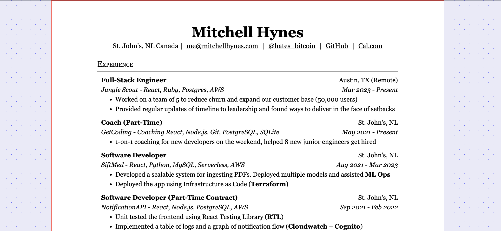

# My resume

Made with Astro, Tailwind, MDX. Resumes are an MDX file in `src/content/resumes.mdx` and can compose HTML components amongst other things like Rich Text. Please feel free to clone it and use it however.

